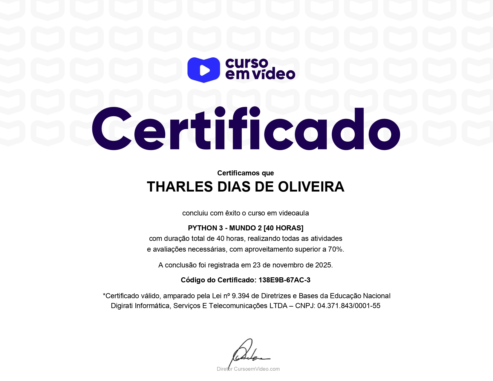

# Lista de exercícios resolvidos em Python🐍

Este é um curso que foi disponibilizado pelos apoiadores gafanhotos e gratuito aos demais alunos, composto por aulas explicativas gravadas e listas de exercícios com resolução tanto no site do curso em vídeo, quanto no canal do curso em vídeo no YouTube.

## 📘 Descrição

Minha resolução da lista de exercícios propostos pelo curso em vídeo de python.

## 📄 Certificados: 

### Python 3 - Mundo 1

Curso Python 3 - Mundo 1, ministrado por Gustavo Guanabara. Exercícios do número 1 ao 35.  
[Curso de Python 3 - Mundo 1: Fundamentos
](https://www.youtube.com/playlist?list=PLHz_AreHm4dlKP6QQCekuIPky1CiwmdI6)

 

Curso Python 3 - Mundo 2, ministrado por Gustavo Guanabara. Exercícios do número 36 ao 71.  
[Curso de Python 3 - Mundo 2: Estruturas de Controle](https://www.youtube.com/playlist?list=PLHz_AreHm4dk_nZHmxxf_J0WRAqy5Czye)

## 💻 Tecnologias

- Python 3

